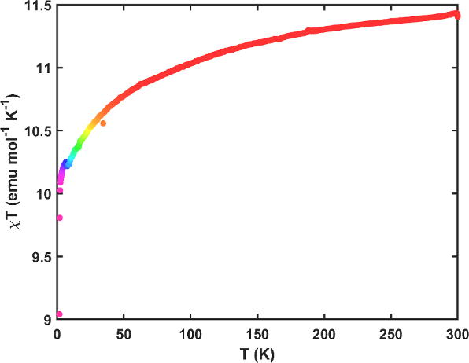
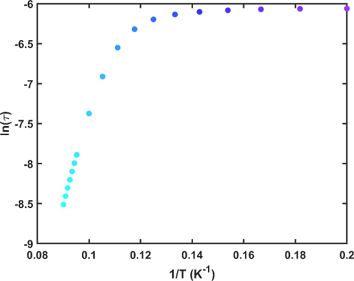
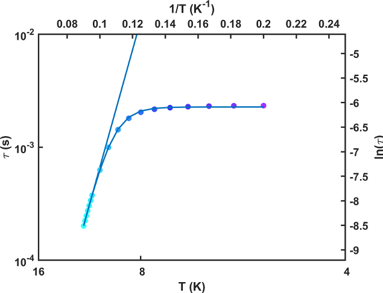

# qdsquid-dataplot
A collection of MATLAB functions that parse and plot data from a Quantum Design MPMS 3 SQUID magnetometer.

## Setup
The folder containing these scripts should be added to your MATLAB path. This can be done by clicking the **Set Path** button under the **Home** tab.

## Usage
Datafiles (.dat) are parsed by classes whose only constructor arguments are filenames. Currently there are four data class types: `AcData`, `DcData`, `SusData`, and `MagData`. The corresponding object properties contain raw, parsed, and fitted data and the object methods perform routine operations on these data (plotting, exporting, etc.). Two additional classes are `Relaxation`, which is responsible for fitting relaxation processes, and `PlotHelper` which provides some static methods for plotting convenience. Type `help SQUIDData` at the MATLAB command prompt for detailed usage information.

## Input files
Datafile headers are parsed and used to perform conversions and corrections to the data. These fields can be set in the 'Sample Properties' window of MultiVu or manually using a text editor. They should be set **before** using this code.

* **Material**: Should be a Matlab-safe variable name. (Good: `Fe_OAc2`) (Bad: `180420-!-BestSMM`) 
See [this](https://www.mathworks.com/help/matlab/matlab_prog/variable-names.html) for more details.
* **Comment**: Not used
* **Sample Holder**: Not used
* **Mass**: Sample mass in mg
* **Volume**: Mass of eicosane (put 0 if no eicosane was used)
* **Molecular Weight**: Sample molecular weight in g mol<sup>-1</sup>
* **Size**: Sample molar diamagnetism (put 0 if uncalculated)
* **Shape**: Not used

## Static susceptibility plotting example
```
>> Er_COT_I_THF2_sus = SusData('04-02-17 - ErI(COT)(THF)2 - MvsT.dat')

Er_COT_I_THF2_sus = 

  SusData with properties:

      Fields: 999.9932
    Filename: '04-02-17 - ErI(COT)(THF)2 - MvsT.dat'
      Header: [1×9 table]
         Raw: [565×89 table]
      Parsed: [565×6 table]

>> figure
>> Er_COT_I_THF2_sus.plotChiT
```


## ac susceptibility plotting and fitting example
```
>> Er_COT_I_THF2_ac = AcData('11-24-17 - ErI(COT)(THF)2 - AC Freq.dat')

Er_COT_I_THF2_ac = 

  AcData with properties:

         Fits: [18×10 table]
    TempRange: [5 11.1000]
     Filename: '11-24-17 - ErI(COT)(THF)2 - AC Freq.dat'
       Header: [1×9 table]
          Raw: [540×89 table]
       Parsed: [540×10 table]

>> figure
>> Er_COT_I_THF2_ac.plotArrhenius
```

```
>> Er_COT_I_THF2_rel = Relaxation(Er_COT_I_THF2_ac)

Er_COT_I_THF2_rel = 

  Relaxation with properties:

         Fits: [18×3 table]
    TempRange: [5 11.1000]
         Ueff: 100
        tau_0: 1.0000e-10
          qtm: NaN
            C: NaN
            n: NaN
      VarsOut: [0×0 table]

>> Er_COT_I_THF2_rel.qtm = 1e-4;
>> Er_COT_I_THF2_rel.fitRelaxation
    LowTemp    HighTemp     Ueff     UeffCi       tau_0        tua_0Ci         qtm          qtmCi        C     CCi     n     nCi
    _______    ________    ______    _______    __________    __________    _________    ___________    ___    ___    ___    ___

        5        11.1      95.521    0.66667    9.2696e-10     7.457e-11    0.0022658     2.9437e-05    NaN    NaN    NaN    NaN

>> Er_COT_I_THF2_rel.qtm = NaN
>> Er_COT_I_THF2_rel.setTempRange([10.5 11.1]);
>> Er_COT_I_THF2_rel.fitRelaxation
    LowTemp    HighTemp     Ueff     UeffCi       tau_0        tua_0Ci         qtm          qtmCi        C     CCi     n     nCi
    _______    ________    ______    _______    __________    __________    _________    ___________    ___    ___    ___    ___

        5        11.1      95.521    0.66667    9.2696e-10     7.457e-11    0.0022658     2.9437e-05    NaN    NaN    NaN    NaN
     10.5        11.1      83.254     1.0761    4.1693e-09    5.2256e-10          NaN            NaN    NaN    NaN    NaN    NaN

>> Er_COT_I_THF2_rel.plotRelaxation(1)
>> Er_COT_I_THF2_rel.plotRelaxation(2)
>> PlotHelper.setArrheniusAxes
>> xlim(1 ./ [16 4])
>> ylim(log([1e-4 1e-2]))
```
